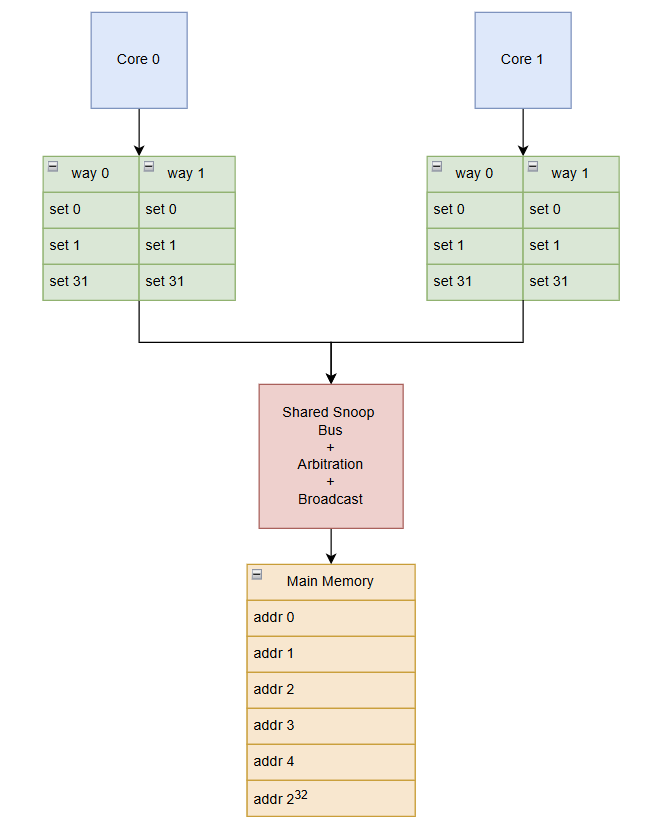
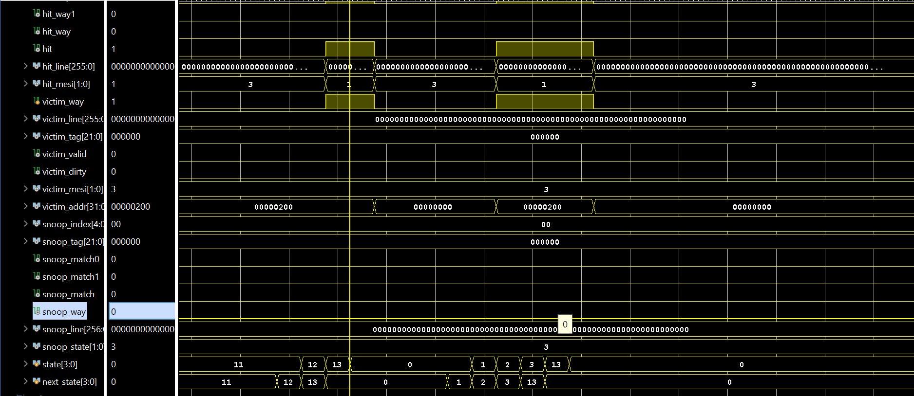
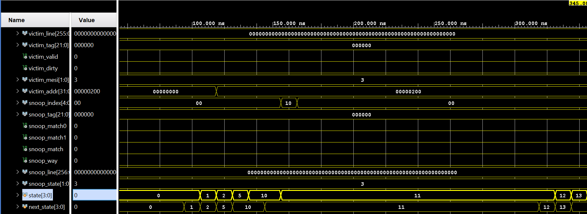
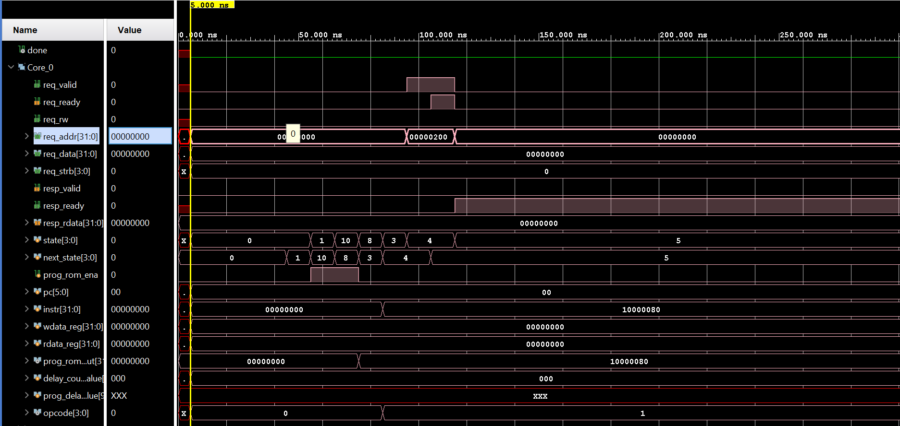
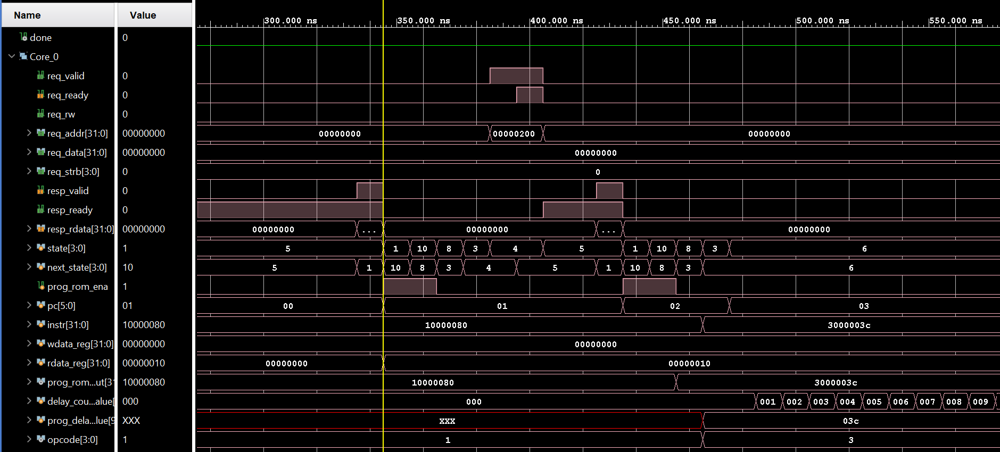
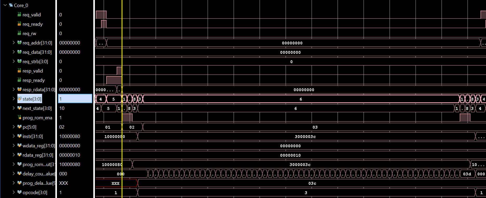
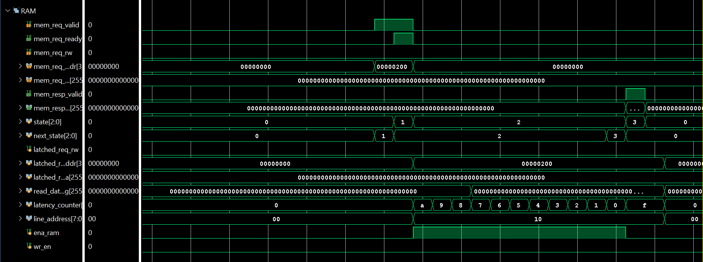

# MESI Cache Coherence Protocol — Dual-Core Processor System

A dual-core processor system implementing the MESI (Modified, Exclusive, Shared, Invalid) 
cache coherence protocol in Verilog. Each core has a private L1 cache with write-back and 
write-allocate policies, connected via a snooping shared bus for inter-cache coherence 
maintenance.

## Architecture Overview

The system consists of two cores each with a private 2-way set-associative L1 cache. 
Cache coherence is maintained through a snooping shared bus that broadcasts memory 
transactions to all caches simultaneously. On a snoop hit, the receiving cache updates 
its MESI state accordingly — transitioning from Modified to Shared on a peer read, or 
invalidating on a peer write. Main memory is accessed only on a cache miss with no 
peer data available.

## MESI Protocol State Transitions

| Current State| Bus Event        | Next State | Action                        |
|--------------|------------------|------------|-------------------------------|
| Modified     | Peer READ        | Shared     | Writeback + share data        |
| Modified     | Peer READX       | Invalid    | Writeback + invalidate        |
| Exclusive    | Peer READ        | Shared     | Share line                    |
| Exclusive    | Peer READX       | Invalid    | Invalidate                    |
| Shared       | Peer READX       | Invalid    | Invalidate                    |
| Shared       | Local WRITE      | Modified   | Bus upgrade request           |
| Invalid      | Local READ miss  | Exclusive  | Bus read request              |
| Invalid      | Local WRITE miss | Modified   | Bus read-exclusive request    |

## Cache Specifications

| Parameter         | Value           |
|-------------------|-----------------|
| Organization      | 2-way set assoc |
| Sets              | 32              |
| Line Size         | 32 bytes        |
| Cache Size        | 2KB per core    |
| Write Policy      | Write-back      |
| Allocate Policy   | Write-allocate  |
| Replacement       | Pseudo-LRU      |
| MESI States       | 4               |

## Synthesis Results — Xilinx Zynq xc7z020clg400-1

| Metric           | Value          |
|------------------|----------------|
| Max Frequency    | 76.9 MHz       |
| Clock Period     | 13.0 ns        |
| Setup Slack      | +0.418 ns      |
| Hold Slack       | +0.084 ns      |
| Slice LUTs       | 4,560 (8.6%)   |
| Slice Registers  | 3,451 (3.2%)   |
| Block RAM        | 2 (1.4%)       |
| Dynamic Power    | 0.016 W        |
| Static Power     | 0.103 W        |
| Total Power      | 0.119 W        |

Timing closure achieved post-implementation with zero hold violations and 
zero unintended latches. Critical path identified on the snoop command to 
MESI state update path with 13 logic levels and high fanout (fo=837) requiring 
clock relaxation from 100MHz to 76.9MHz.

## Simulation Waveforms

| Scenario              | Waveform                                    |
|-----------------------|---------------------------------------------|
| Cache 0 Read Hit      |      |
| Cache 0 Read Miss     |     |
| Core 0 Read Request   |       |
| Core 0 Read Hit       |       |
| Core 0 Delay          |          |
| Memory Read           |             |

## File Structure

| Path                        | Description                              |
|-----------------------------|------------------------------------------|
| rtl/top_module.v            | Top level instantiation                  |
| rtl/l1_cache.v              | L1 cache with MESI FSM controller        |
| rtl/shared_snoop_bus.v      | Snooping bus and coherence arbitration   |
| rtl/main_memory.v           | Synchronous main memory with FSM         |
| rtl/core_gen.v              | Core 0 traffic generator                 |
| rtl/core_gen1.v             | Core 1 traffic generator                 |
| sim/tb_top_module.v         | Top level system testbench               |
| sim/tb_l1_cache.v           | L1 cache unit testbench                  |
| sim/tb_main_memory.v        | Main memory unit testbench               |
| sim/tb_core_gen.v           | Core generator unit testbench            |
| constraints/constraints.xdc | Timing and IO constraints                |
| docs/waveforms/             | Simulation waveform screenshots          |

## How to Simulate

1. Clone the repository 
	git clone https://github.com/Dual-Core-MESI-Protocol/dual-core-MESI-cache-coherence-protocol
2. Open Vivado and create a new RTL project
3. Add all files from `rtl/` as design sources
4. Add your target file from `sim/` as simulation source
5. Set `top_module` as the top level for synthesis
6. Set `tb_top_module` as the top level for simulation
7. Add `constraints/constraints.xdc` as constraint source
8. Run Behavioral Simulation

## Important Note on IP Cores

This project uses the Xilinx Block Memory Generator IP from the 
Vivado IP Catalog. After cloning, you must regenerate the IP before 
simulating or synthesizing:

1. Open Vivado and create a new project
2. Add all files from `rtl/` as design sources
3. Go to IP Catalog and add Block Memory Generator
4. Configure with the following settings:
   Main Memory:  	
   - Memory Type: Single Port RAM
   - Width: 256 bits
   - Depth: 256
   - Enable Port Type: Use ENA Pin

   Core Generator:
   - Memory Type: Single Port ROM
   - Width: 32
   - Depth: 64
   - Enable Port Type: Use ENA Pin
5. Generate the IP and run simulation

## Important Note on IP Cores

This project uses the Xilinx Block Memory Generator IP initialized 
with a `.coe` memory file containing the instruction program for 
both core generators.

After cloning:
1. Open Vivado and create a new project
2. Add all files from `rtl/` as design sources
3. Regenerate the Block Memory Generator IP using the provided 
   `.coe` file in the `mem/` folder

## Tools

- **HDL**            : Verilog
- **Synthesis**      : Xilinx Vivado 2025.1
- **Target Device**  : Xilinx Zynq xc7z020clg400-1
- **Simulator**      : Vivado Behavioral Simulator

## Author

**Ananda Thirtha Holehonnur Ravi**  
MS Computer Engineering — California State University, Northridge  
[LinkedIn](https://linkedin.com/in/ananda-thirtha-holehonnur-ravi)
README